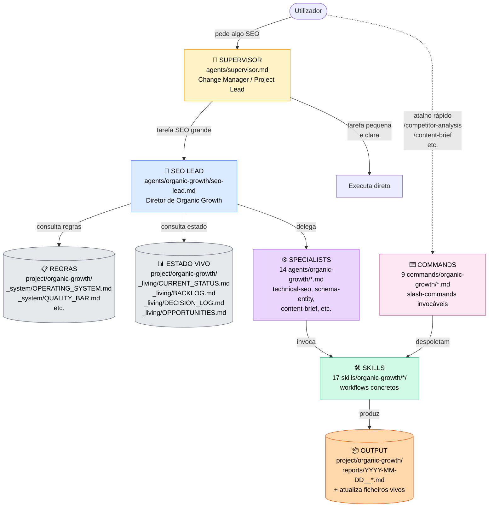
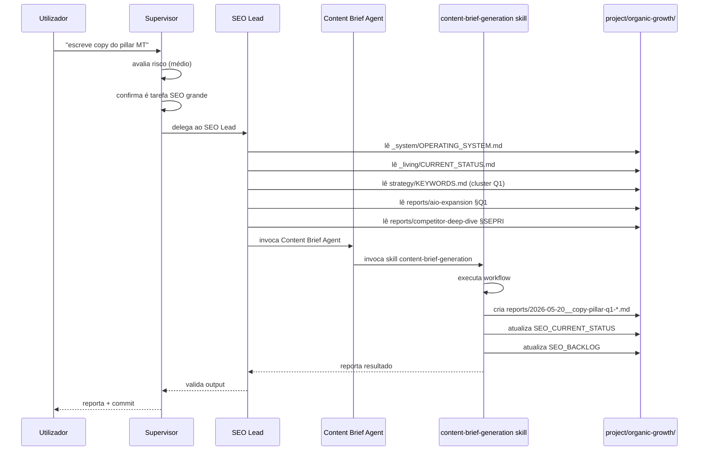

# Mapa de Arquitetura — Supervisor + Organic Growth — 2026-05-20

> **Propósito:** mapear toda a infraestrutura SEO/Organic Growth do projeto antes de reorganizar pastas. Mostra **o que existe**, **onde está**, **o que faz** e **como se relacionam**.
>
> **Não muda nada.** É documento de análise.

## TL;DR

O sistema tem **4 camadas funcionais** distribuídas por **4 pastas físicas** dentro de `.claude/`:

| Camada | Função | Pasta física | Quantidade |
|---|---|---|---|
| 1. Supervisor | Decisão / Change Management | `.claude/agents/supervisor.md` | 1 ficheiro |
| 2. SEO Lead + specialists | Papéis SEO (definições) | `.claude/agents/organic-growth/` | 15 ficheiros |
| 3. Skills | Workflows concretos | `.claude/skills/organic-growth/` | 17 pastas |
| 4. Commands | Atalhos invocáveis pelo user | `.claude/commands/organic-growth/` | 9 commands |
| **OUTPUT** | Dados deste projeto (Previmed) | `.claude/project/organic-growth/` | 41 ficheiros |

**Diagnóstico:** as 4 camadas estão **bem definidas conceptualmente**. O que está mal organizado é o **OUTPUT** (`project/organic-growth/`) — 23 ficheiros planos na raiz misturam 6 tipos diferentes de conteúdo.

---

## 1. Visão geral — quem decide o quê



### Lógica das camadas

1. **Supervisor** — decide se planeia ou executa, define lotes, valida resultados, é o porteiro do change management.
2. **SEO Lead** — diretor da área SEO; tem visão estratégica; delega para specialists.
3. **Specialists** — papéis técnicos focados (technical-seo, schema-entity, content-brief, internal-linking, etc.).
4. **Skills** — "como fazer X passo a passo"; são chamadas pelos specialists ou diretamente por commands.
5. **Commands** — atalhos para o utilizador disparar workflows sem ter de invocar agents.
6. **Project** — onde tudo o que é produzido fica guardado.

---

## 2. Camada 1 — Supervisor (1 ficheiro)

**Localização:** [`.claude/agents/supervisor.md`](../../../agents/supervisor.md) (959 linhas)

**Função:**
- Coordena qualquer alteração no projeto WordPress.
- Decide entre **Planning Mode** (planear, não tocar) e **Implementation Mode** (executar).
- Aplica change management: avalia risco, divide por lotes, define rollback.
- Protege áreas sensíveis (tema ativo, plugins, slugs, redirects, deploy).

**Modos:**

```
                  USER pede algo
                        │
                        ▼
              ┌──────────────────┐
              │  É exploratório, │
              │  abstrato, ou    │
              │  pedido grande?  │
              └──────────────────┘
                  │           │
              Sim │           │ Não
                  ▼           ▼
          ┌──────────┐  ┌──────────────┐
          │ PLANNING │  │ IMPLEMENTATION│
          │   MODE   │  │    MODE      │
          └──────────┘  └──────────────┘
            │                  │
            ▼                  ▼
          Não toca ficheiros  Executa por lotes
          Organiza ideias     Valida entre lotes
          Propõe caminho      Reporta resultado
```

**Tabela de risco** (do supervisor):

| Risco | Exemplos | Requer |
|---|---|---|
| Baixo | texto, labels, CSS local | direto, com cuidado |
| Médio | filtros, cards, secções | plano curto + critérios aceitação |
| Alto | functions.php, schema global, slugs | análise + lotes + rollback + validação utilizador |
| Crítico | produção, deploy, BD, plugins | confirmação explícita + plano rollback + nunca automático |

---

## 3. Camada 2 — SEO Lead + 13 Specialists (15 ficheiros)

**Localização:** [`.claude/agents/organic-growth/`](../../../agents/organic-growth/)

### Hierarquia

```
SEO LEAD (6658 bytes — diretor)
  ↓ delega para
  
  📊 Análise & Dados
  ├── seo-data-analyst.md
  └── serp-competitor-analyst.md
  
  🎯 Pesquisa & Intenção
  └── keyword-intent.md
  
  ⚙️ SEO Técnico
  ├── technical-seo.md
  ├── schema-entity.md
  ├── cwv-performance-seo.md
  └── wordpress-seo-implementation.md
  
  ✍️ Conteúdo & On-page
  ├── content-brief.md
  ├── onpage-seo.md
  └── internal-linking.md
  
  🌍 Especialidades
  ├── local-seo.md
  ├── ai-search-visibility.md
  └── seo-qa.md
```

**Princípio do SEO Lead:**
> SEO excelente não é uma lista de truques. SEO excelente é alinhar intenção, qualidade, técnica, autoridade, velocidade, experiência e negócio.

---

## 4. Camada 3 — Skills (17 pastas)

**Localização:** [`.claude/skills/organic-growth/`](../../../skills/organic-growth/)

Cada skill é uma **rotina executável**. Skills disponíveis:

| Skill | Para que serve |
|---|---|
| `ai-search-visibility-review` | Avaliar presença em AIO/Modo IA |
| `competitor-gap-analysis` | Identificar lacunas vs concorrentes |
| `content-brief-generation` | Produzir brief editorial |
| `cwv-performance-seo-review` | Core Web Vitals + Lighthouse |
| `gsc-ga4-analysis` | Análise de dados GSC + GA4 |
| `internal-linking-architecture` | Plano de linking interno |
| `keyword-cluster-map` | Mapear clusters de queries |
| `local-seo-review` | Auditoria local (GBP, NAP) |
| `onpage-optimization-pass` | Otimização on-page |
| `page-quality-audit` | Auditoria de qualidade por página |
| `schema-entity-review` | Validar schema markup + entidades |
| `seo-operating-system` | Aplicar workflow padrão SEO |
| `seo-quality-gate` | Gate de qualidade pré-publicação |
| `seo-reporting-dashboard` | Relatórios consolidados |
| `serp-intent-audit` | Auditoria de SERP por query |
| `technical-seo-crawl-audit` | Crawl técnico completo |
| `wordpress-seo-implementation` | Implementação em WordPress |

---

## 5. Camada 4 — Commands (9 commands)

**Localização:** [`.claude/commands/organic-growth/`](../../../commands/organic-growth/)

Atalhos `/slash` que o utilizador pode invocar diretamente:

| Comando | O que faz |
|---|---|
| `/competitor-analysis` | Análise de concorrência |
| `/content-brief` | Gera brief editorial |
| `/gsc-analysis` | Analisa GSC |
| `/local-seo` | Auditoria local |
| `/page-review` | Revisão de página |
| `/schema-review` | Revisão de schema |
| `/seo-go-live` | Pipeline de go-live |
| `/seo-strategy` | Estratégia SEO |
| `/technical-audit` | Auditoria técnica |

---

## 6. OUTPUT — `project/organic-growth/` (41 ficheiros)

Aqui é onde o sistema **falha em organização** atualmente.

### Estado atual (plano, sem hierarquia)

```
.claude/project/organic-growth/
├── README.md
├── _TEMPLATE_seo-report.md (dentro de reports/)
│
├── 🟦 REGRAS (5 ficheiros mas misturadas)
│   ├── _system/OPERATING_SYSTEM.md
│   ├── _system/QUALITY_BAR.md
│   ├── _system/GLOSSARY.md
│   ├── _system/TOOLING_MCP_STACK.md
│   └── _system/KPI_MODEL.md
│
├── 🟩 ESTADO VIVO (4 ficheiros)
│   ├── _living/CURRENT_STATUS.md
│   ├── _living/BACKLOG.md
│   ├── _living/DECISION_LOG.md
│   └── _living/OPPORTUNITIES.md
│
├── 🟨 PLAYBOOKS (5 ficheiros)
│   ├── _system/playbooks/COMPETITOR_RESEARCH.md
│   ├── _system/playbooks/CONTENT_SYSTEM.md
│   ├── _system/playbooks/TECHNICAL_AUDIT.md
│   ├── _system/playbooks/SCHEMA_ENTITY_MODEL.md
│   └── _system/playbooks/LOCAL_PLAYBOOK.md
│
├── 🟧 ESTRATÉGIA Fase 1 (5 ficheiros)
│   ├── STRATEGY.md
│   ├── strategy/AUDIENCES.md
│   ├── strategy/INFORMATION_ARCHITECTURE.md
│   ├── strategy/KEYWORDS.md
│   └── strategy/COMPETITORS.md
│
├── 🟥 SETUP/DECISÕES Fase 2 (3 ficheiros)
│   ├── setup/BASELINE_AUDIT.md
│   ├── setup/KEYWORD_DATA_DECISION.md
│   └── setup/GSC_GA4_SETUP.md
│
├── reports/ (18 ficheiros datados — MISTURADOS)
│   ├── 🔍 Análises (4)
│   │   ├── 2026-05-20__aio-expansion.md
│   │   ├── 2026-05-20__competitor-deep-dive.md
│   │   ├── 2026-05-20__previmed-pages-audit.md
│   │   └── 2026-05-20__architecture-map.md (este ficheiro)
│   ├── 📋 Planos (2)
│   │   ├── 2026-05-20__execution-plan-90d.md
│   │   └── 2026-05-20__spin-offs-briefs.md
│   ├── ✍️ Briefs (5)
│   │   └── 2026-05-20__content-brief-{q1-q5}.md
│   ├── 📄 Copies (6)
│   │   ├── 2026-05-20__copy-pillar-{q1-q5}.md
│   │   └── 2026-05-20__copy-spinoff-avenca-vs-ato.md
│   └── _TEMPLATE_seo-report.md (template)
│
└── aio-captures/ (5 snapshots Playwright .yml)
```

### Problema identificado

**6 tipos de conteúdo diferentes na mesma raiz** sem separação física:

| Tipo | Função | Quantos | Devia estar em |
|---|---|---|---|
| 🟦 Regras | Como trabalhar | 5 | `_system/` |
| 🟩 Estado vivo | Estado atual | 4 | `_living/` |
| 🟨 Playbooks | Workflows por área | 5 | `_system/` ou `playbooks/` |
| 🟧 Estratégia | Fase 1 fechada | 5 | `strategy/` |
| 🟥 Setup/decisões | Lotes específicos | 3 | `setup/` ou junto a `_living/` |
| Análises datadas | Snapshots no tempo | 4 | `reports/` ✅ correto |
| Planos | Roadmaps | 2 | `reports/` ✅ correto |
| Briefs editoriais | Specs de conteúdo | 5 | `clusters/q<N>-*/BRIEF.md` |
| Copies finais | Conteúdo a publicar | 6 | `clusters/q<N>-*/COPY.md` |
| Snapshots brutos | Evidência Playwright | 5 | `clusters/q<N>-*/aio-capture.yml` ou `_evidence/` |

---

## 7. Fluxo completo — pedido SEO real

Exemplo: utilizador pede *"escreve copy para o pillar de Medicina do Trabalho"*.



**Onde a estrutura atual falha neste fluxo:**

1. **Passo 4-5:** o SEO Lead tem de ler **5 ficheiros diferentes** na raiz misturada para perceber o estado de Q1.
2. **Passo 9:** o output sai para `reports/` com nome datado, mas o **brief Q1 anterior** e **outros copies Q1 futuros** ficarão noutros ficheiros sem ligação física.
3. **Passo 10-11:** os ficheiros vivos vão acumular linhas sobre Q1 dispersas entre Q2, Q3, etc.

---

## 8. Diagnóstico de problemas

### O que está bem ✅

- **Separação clara das 4 camadas funcionais** (Supervisor / Lead / Specialists / Skills).
- **Persistence rule** aplicada (todas as análises grandes em `reports/`).
- **Ficheiros vivos curtos** (CURRENT_STATUS, BACKLOG, etc.) bem definidos.
- **Glossário plain-language** existe para reduzir jargão.
- **Naming convention datada** (`YYYY-MM-DD__type.md`) funciona.

### O que está mal ❌

- **23 ficheiros planos na raiz** sem separação física por tipo.
- **`reports/` mistura 4 tipos** de conteúdo com ciclos de vida diferentes (análises = snapshot; copies = vivos e editáveis).
- **Brief Q1 e Copy Q1** vivem em ficheiros separados → drift se editar um e esquecer o outro.
- **Snapshots brutos** (`aio-captures/`) estão soltos sem ligação ao cluster a que pertencem.
- **Conhecimento por cluster está fragmentado** em 5+ ficheiros por cluster.

### O que vai piorar com o tempo

- 15 spin-offs futuros = +15 briefs + +15 copies em `reports/` = 30 ficheiros datados adicionais.
- Refactor de pillars (refresh com `dateModified` novo) = mais ficheiros datados.
- Recaptura AIO t+30/90/180d = 3 ficheiros datados adicionais que precisam de comparar com os de 2026-05-20.
- Em 6 meses: 60+ ficheiros em `reports/` com mistura de tipos.

---

## 9. Recomendação de reorganização

> Apenas proposta — **não aplicar sem confirmação**.

### Estrutura-alvo

```
.claude/project/organic-growth/
│
├── README.md                          ← índice e mapa de leitura
│
├── _system/                           ← REGRAS DE TRABALHO (raras alterações)
│   ├── OPERATING_SYSTEM.md            ← persistence rule, anti-token-waste
│   ├── QUALITY_BAR.md
│   ├── KPI_MODEL.md
│   ├── GLOSSARY.md                    ← jargão explicado
│   ├── TOOLING_MCP_STACK.md           ← política orçamento zero
│   └── playbooks/                     ← workflows por área
│       ├── COMPETITOR_RESEARCH.md
│       ├── CONTENT_SYSTEM.md
│       ├── TECHNICAL_AUDIT.md
│       ├── SCHEMA_ENTITY_MODEL.md
│       └── LOCAL_PLAYBOOK.md
│
├── _living/                           ← ESTADO ATUAL CURTO (atualiza frequente)
│   ├── CURRENT_STATUS.md
│   ├── BACKLOG.md
│   ├── DECISION_LOG.md
│   └── OPPORTUNITIES.md
│
├── strategy/                          ← FASE 1 (fechada)
│   ├── STRATEGY.md                    ← documento mestre
│   ├── AUDIENCES.md
│   ├── INFORMATION_ARCHITECTURE.md
│   ├── KEYWORDS.md
│   └── COMPETITORS.md
│
├── setup/                             ← DECISÕES + GUIAS SETUP
│   ├── BASELINE_AUDIT_2026-05-20.md   ← rebatizar AUDIT_PREVIMED_BASELINE
│   ├── KEYWORD_DATA_DECISION.md
│   └── GSC_GA4_SETUP.md
│
├── reports/                           ← APENAS análises datadas (snapshots no tempo)
│   ├── _TEMPLATE_seo-report.md
│   ├── 2026-05-20__aio-expansion.md
│   ├── 2026-05-20__competitor-deep-dive.md
│   ├── 2026-05-20__previmed-pages-audit.md
│   ├── 2026-05-20__architecture-map.md
│   ├── 2026-05-20__execution-plan-90d.md
│   └── 2026-05-20__spin-offs-briefs.md
│
└── clusters/                          ← CONTEÚDO EDITORIAL VIVO POR CLUSTER
    ├── README.md                      ← mapa dos clusters Q1-Q5
    ├── q1-medicina-trabalho/
    │   ├── BRIEF.md                   ← spec editorial
    │   ├── COPY.md                    ← copy a publicar
    │   ├── aio-capture.yml            ← evidência
    │   └── spin-offs/
    │       ├── ficha-aptidao/
    │       │   ├── BRIEF.md
    │       │   └── COPY.md
    │       └── periodicidade-exames/
    │           └── BRIEF.md
    ├── q2-seguranca-trabalho/
    │   ├── BRIEF.md
    │   ├── COPY.md
    │   └── aio-capture.yml
    ├── q3-haccp/
    │   ├── BRIEF.md
    │   ├── COPY.md
    │   └── aio-capture.yml
    ├── q4-formacao-40h/
    │   ├── BRIEF.md
    │   ├── COPY.md
    │   └── aio-capture.yml
    └── q5-escolher-mt/
        ├── BRIEF.md
        ├── COPY.md
        ├── aio-capture.yml
        └── spin-offs/
            └── avenca-vs-ato/
                ├── BRIEF.md
                └── COPY.md
```

### Vantagens claras

1. **Procurar tudo sobre Q1?** → `clusters/q1-medicina-trabalho/` — 1 pasta.
2. **Brief e Copy juntos?** → mesmo diretório → impossível esquecer sincronizar.
3. **Regras nunca confundem-se com estado vivo** → `_system/` vs `_living/`.
4. **Estratégia Fase 1 separada** → fica clara como "fechada".
5. **`reports/` fica curto** — só análises datadas reais (10 ficheiros vs 18).
6. **Crescimento previsível** — novos clusters = novas pastas em `clusters/`, não mais ruído em `reports/`.

### Mapeamento de migração (origem → destino)

| Origem (atual) | Destino (proposto) |
|---|---|
| `_system/OPERATING_SYSTEM.md` | `_system/OPERATING_SYSTEM.md` |
| `_system/QUALITY_BAR.md` | `_system/QUALITY_BAR.md` |
| `_system/KPI_MODEL.md` | `_system/KPI_MODEL.md` |
| `_system/GLOSSARY.md` | `_system/GLOSSARY.md` |
| `_system/TOOLING_MCP_STACK.md` | `_system/TOOLING_MCP_STACK.md` |
| `_system/playbooks/COMPETITOR_RESEARCH.md` | `_system/playbooks/COMPETITOR_RESEARCH.md` |
| `_system/playbooks/CONTENT_SYSTEM.md` | `_system/playbooks/CONTENT_SYSTEM.md` |
| `_system/playbooks/TECHNICAL_AUDIT.md` | `_system/playbooks/TECHNICAL_AUDIT.md` |
| `_system/playbooks/SCHEMA_ENTITY_MODEL.md` | `_system/playbooks/SCHEMA_ENTITY_MODEL.md` |
| `_system/playbooks/LOCAL_PLAYBOOK.md` | `_system/playbooks/LOCAL_PLAYBOOK.md` |
| `_living/CURRENT_STATUS.md` | `_living/CURRENT_STATUS.md` |
| `_living/BACKLOG.md` | `_living/BACKLOG.md` |
| `_living/DECISION_LOG.md` | `_living/DECISION_LOG.md` |
| `_living/OPPORTUNITIES.md` | `_living/OPPORTUNITIES.md` |
| `STRATEGY.md` | `strategy/STRATEGY.md` |
| `strategy/AUDIENCES.md` | `strategy/AUDIENCES.md` |
| `strategy/INFORMATION_ARCHITECTURE.md` | `strategy/INFORMATION_ARCHITECTURE.md` |
| `strategy/KEYWORDS.md` | `strategy/KEYWORDS.md` |
| `strategy/COMPETITORS.md` | `strategy/COMPETITORS.md` |
| `setup/BASELINE_AUDIT.md` | `setup/BASELINE_AUDIT.md` |
| `setup/KEYWORD_DATA_DECISION.md` | `setup/KEYWORD_DATA_DECISION.md` |
| `setup/GSC_GA4_SETUP.md` | `setup/GSC_GA4_SETUP.md` |
| `reports/...__content-brief-medicina-trabalho.md` | `clusters/q1-medicina-trabalho/BRIEF.md` |
| `reports/...__copy-pillar-q1-*.md` | `clusters/q1-medicina-trabalho/COPY.md` |
| `clusters/aio-q1-*.yml` | `clusters/q1-medicina-trabalho/aio-capture.yml` |
| (idem Q2, Q3, Q4, Q5) | (clusters/q2…/q5…) |
| `reports/...__copy-spinoff-avenca-vs-ato.md` | `clusters/q5-escolher-mt/spin-offs/avenca-vs-ato/COPY.md` |
| `reports/...__aio-expansion.md` | `reports/2026-05-20__aio-expansion.md` (fica) |
| `reports/...__competitor-deep-dive.md` | `reports/` (fica) |
| `reports/...__previmed-pages-audit.md` | `reports/` (fica) |
| `reports/...__execution-plan-90d.md` | `reports/` (fica) |
| `reports/...__spin-offs-briefs.md` | `reports/` (fica) |
| `reports/...__architecture-map.md` | `reports/` (fica — este ficheiro) |

**Total: 41 ficheiros para reorganizar; 10 ficam onde estão (em `reports/`).**

---

## 10. Plano de migração (se aprovado)

Em 3 fases, todas em `git` para rollback fácil:

### Fase 1 — Criar pastas + mover ficheiros não-tocados (5 min)

`git mv` dos ficheiros que não precisam de edição:
- `_system/` + `_living/` + `strategy/` + `setup/` criados.
- 22 ficheiros movidos com histórico git preservado.

### Fase 2 — Criar `clusters/` e migrar briefs+copies (15 min)

Para cada cluster Q1–Q5:
- Criar pasta `clusters/q<N>-<slug>/`.
- `git mv` brief para `BRIEF.md`.
- `git mv` copy para `COPY.md`.
- `git mv` snapshot AIO para `aio-capture.yml`.
- Criar `spin-offs/` onde existir conteúdo.

### Fase 3 — Atualizar links internos (15 min)

Os ficheiros vivos (`CURRENT_STATUS`, `BACKLOG`, etc.) têm links para ficheiros que mudaram de sítio. Atualizar todos.

Atualizar também `README.md` raiz com novo mapa.

### Validação

- `git log --follow` em qualquer ficheiro movido → histórico preservado.
- Procurar links partidos com `grep -r "reports/2026-05-20__content-brief"` antes/depois.
- Commit único `refactor(seo): reorganizar estrutura organic-growth por pastas funcionais`.

**Esforço total:** ~45 min. **Risco:** baixo (só `git mv` + edits de links). **Rollback:** revert do commit único.

---

## 11. Próximos passos para o utilizador

Em ordem:

1. **Ler este ficheiro** para perceber a estrutura completa atual.
2. **Decidir se quer aplicar** a reorganização proposta (secção 9) ou ajustar.
3. Se aprovar: digo "aplica" e executo a migração nas 3 fases acima.
4. Se quer ajustar (ex.: nomes diferentes, hierarquia diferente): dizes e revejo.

## Last Updated

2026-05-20 por Claude (SEO Lead, em modo Supervisor / Change Manager).
